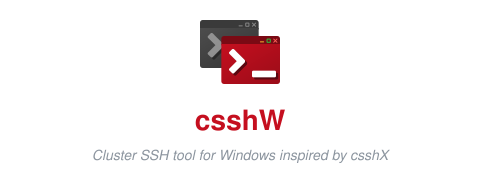
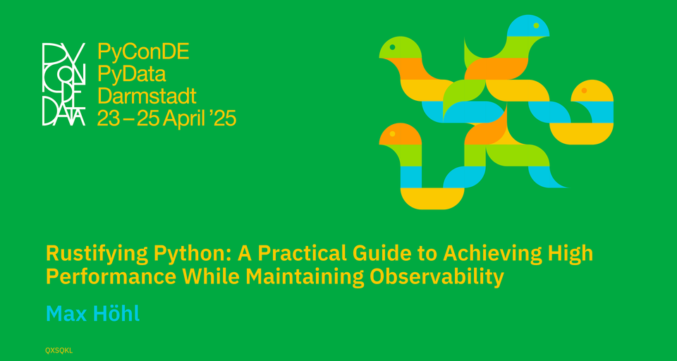

I work on the metric backend of [Checkmk](https://checkmk.com), the new data backend for OpenTelemetry metrics that lets Checkmk monitor applications, not just infrastructure.\
Before that I was at SAP, building the CI/CD infrastructure for HANA (their in-memory database): a graph-based task execution framework running on ~2000 compute nodes.\
That's where I learned that at sufficient scale everything fails all the time, and the only real feature is being able to watch it happen.

Python and TypeScript at work, Rust to relax, and a 🦆 for the hard parts.

#### Things I made

  

  One window that broadcasts your keystrokes to any number of SSH sessions. 
  A cross-platform successor is in the works (<a href="https://github.com/whmade/cssh-rs">cssh-rs</a>).

  

  Figuring out which parts of a Python codebase are worth moving to Rust, why, and what will go wrong when you do. 
  Based on my team doing exactly that at SAP.

#### Currently working on

<!-- activity:start -->
<code>2026-08-01 09:01 UTC</code>&emsp; [**whmade/cssh-rs**](https://github.com/whmade/cssh-rs)  [automation: pin Git bash for ScriptedShellMode forced command (#262)](https://github.com/whmade/cssh-rs/commit/70f73e63021f974c67608b2e1e3ba8cde350b802)\
<code>2026-07-31 12:52 UTC</code>&emsp; [**Checkmk/checkmk**](https://github.com/Checkmk/checkmk)  [metric-backend: make dropdowns with an empty state clearable](https://github.com/Checkmk/checkmk/commit/31fe0c7e22e8d530652fca198675c2f87c23e79c)\
<code>2026-07-10 17:53 UTC</code>&emsp; [**whme/csshw**](https://github.com/whme/csshw)  [Delete .github/dependabot.yml](https://github.com/whme/csshw/pull/270)\
<code>2026-06-23 09:40 UTC</code>&emsp; [**Checkmk/otter**](https://github.com/Checkmk/otter)  [Add `dispatch` trigger for workflow-to-workflow handoff](https://github.com/Checkmk/otter/pull/1)
<!-- activity:end -->

The list above refreshes daily via a [small workflow](.github/workflows/update-readme.yml).\
The 🦆 is maintained by hand.
